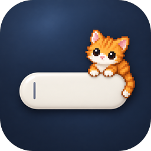

# hub-plugin-petdex

Плагин [Agents Hub](https://github.com/flagman/agents-hub-core): питомец из открытой галереи
[petdex.dev](https://petdex.dev) сидит на поле ввода открытой сессии и показывает, что она делает - теми же кадрами,
что у питомцев Petdex в Codex и Claude Code:



| Сессия | Питомец |
|---|---|
| работает | бежит |
| спрашивает вас, ждёт разрешения | машет |
| закончила ход | прыгает |
| ждёт свою фоновую работу | смотрит, думает |
| поднимается | ждёт |
| упала | грустит |
| свободна | дышит |

Клик по питомцу - прыжок. Выбор из тысяч питомцев - «Настройки» → «Питомец», с поиском по имени. Там же - где он
сидит: на поле ввода сессии (его можно перетащить вдоль края) или в шапке списка сессий, где он показывает весь флот:
кто-то ждёт вас - машет, кто-то упал - грустит, работают - бежит.

## Как устроено

- `main.py` - процесс рядом с хабом (`run`). Держит копию каталога Petdex (`<папка состояния>/petdex/manifest.json`,
  обновляется раз в сутки) и ищет по ней: сам каталог отдаётся без CORS, страница его прочитать не может. Картинки
  выбранного питомца и миниатюры скачивает с `assets.petdex.dev` один раз. Говорит со страницей хаба на
  `127.0.0.1:<порт страницы + 9>` и только с ней.
- Выбранный питомец - пост в канал плагина (API 1.2), поэтому он один на всех страницах хаба, в том числе с телефона
  (там картинка берётся прямо с `assets.petdex.dev`).
- `web/main.js` - модуль страницы: питомец на поле ввода (место `session.composer`) или в шапке боковой панели
  (`sidebar.header`) и вкладка «Питомец». Место и позиция - настройка этого браузера.

Код Petdex (CLI, приложение, хуки агентов) не ставится и не запускается. Плагин не шлёт в Petdex телеметрию и счётчики
установок, только скачивает публичные каталог и картинки. У каждого питомца свой автор, он указан во вкладке со
ссылкой на страницу питомца.

## Тесты

```
PYTHONPATH=<папка кода хаба>:. python3 -m unittest discover -s tests
```
